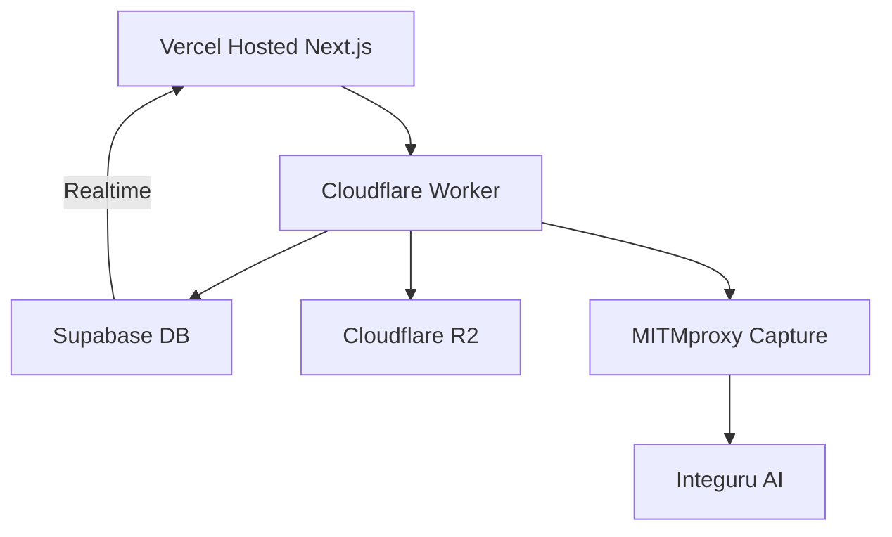

<!-- [text](https://github.com/dhravya/backend-api-kit) -->

# Auto-Schema Generation System

## Feature Intent
Build a URL-driven schema generator that:
1. Accepts web app URLs via Next.js/Vercel form
2. Captures API traffic patterns via MITMproxy
3. Generates Supabase schemas + REST endpoints using AI
4. Provides realtime progress updates
5. Optimizes delivery via Cloudflare
6. Provides user-friendly interface for schema customization

## Architecture

### Components
1. **Schema Builder Interface**
   - Table name input field
   - Dynamic field creation system
   - Data type selection (text, integer, decimal, boolean)
   - Required/Not Null toggle
   - Unique constraint toggle
   - Real-time SQL preview

2. **SQL Generation Engine**
   - Automatic UUID primary key generation
   - Created/Updated timestamps
   - Automatic updated_at trigger
   - Field definitions with constraints

3. **Proxy & Traffic Analysis**


## Implementation

### 1. State Management
```typescript
interface Field {
  name: string;
  type: string;
  isRequired: boolean;
  isUnique: boolean;
}

const [tableName, setTableName] = useState('');
const [fields, setFields] = useState<Field[]>([
  { name: '', type: 'text', isRequired: false, isUnique: false }
]);
```

### 2. SQL Generation Function
```typescript
const generateSQL = () => {
  if (!tableName) return '';

  const fieldDefinitions = fields
    .filter(field => field.name)
    .map(field => {
      let definition = `"${field.name}" ${field.type.toUpperCase()}`;
      if (field.isRequired) definition += ' NOT NULL';
      if (field.isUnique) definition += ' UNIQUE';
      return definition;
    })
    .join(',\n  ');

  return `
  CREATE TABLE ${tableName} (
    id UUID PRIMARY KEY DEFAULT gen_random_uuid(),
    ${fieldDefinitions},
    created_at TIMESTAMP WITH TIME ZONE DEFAULT TIMEZONE('utc', NOW()),
    updated_at TIMESTAMP WITH TIME ZONE DEFAULT TIMEZONE('utc', NOW())
  );
  `;
};
```

### 3. Database Configuration
```sql
-- Analysis Jobs Table
CREATE TABLE analysis_jobs (
  id uuid PRIMARY KEY DEFAULT uuid_generate_v4(),
  url text NOT NULL,
  status text DEFAULT 'pending',
  schema jsonb,
  created_at timestamptz DEFAULT now()
);

ALTER PUBLICATION supabase_realtime ADD TABLE analysis_jobs;

-- Execute SQL Function
CREATE OR REPLACE FUNCTION execute_sql(sql_string TEXT)
RETURNS void
LANGUAGE plpgsql
SECURITY DEFINER
AS $$
BEGIN
  EXECUTE sql_string;
END;
$$;
```

### 4. MITMproxy Integration
```python
# capture_script.py
from mitmproxy import http
import json

def request(flow: http.HTTPFlow):
    if flow.request.pretty_host == "target-app.com":
        entry = {
            "method": flow.request.method,
            "path": flow.request.path,
            "headers": dict(flow.request.headers)
        }
        print(json.dumps(entry))
```

### 5. Cloudflare Worker Setup
```javascript
// workers/schema-processor.js
export default {
  async fetch(request, env) {
    // Process schema generation requests
    // Handle proxy data analysis
    // Manage schema updates
  }
}
```

## Deployment Pipeline
```bash
# Deploy all components
vercel deploy --prod
wrangler deploy
supabase db push
docker-compose up -d mitmproxy
```

## Error Handling
- Validate table names and field definitions
- Handle SQL execution errors
- Manage proxy connection failures
- Process API analysis errors
- Provide clear error messages to users